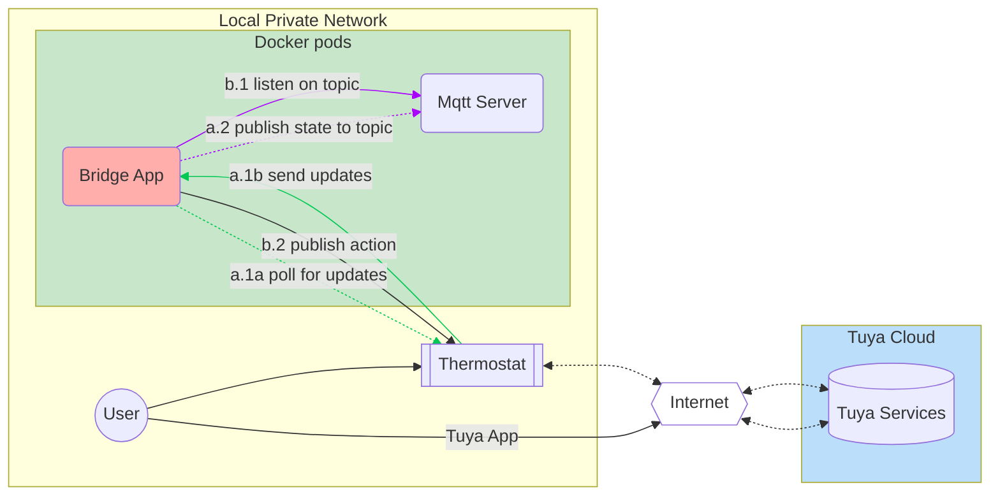

# Introduction
This repository contains a utility application capable of running in a docker pod, designed to interact with local Tuya-based thermostats and integrate them with an MQTT server.
The main purpose is to publish and control a tuya based Moe's BHT-002 GALW Thermostat via mqtt, while keeping the Tuya Cloud connection (not using cloud-cutter).

# High Level Design

---



---

# Debugging and Observations

* The communication to the device breaks up sometimes, some commands seem to result in the device breaking connection for up to a minute.
* The "BHT-002" device has various quirks, there is no update sent by the device when eco mode is switched on (hence, I'm polling for a full status update every minute; there the info is updated)


## SETUP / Get tuya device credentials and identification

Based on the TinyTuya project: https://github.com/jasonacox/tinytuya
You can connect directly to the api exposed by a Tuya device directly from your local network. The communication runs on the private network only, but the credentials are pushed and managed by the tuya cloud solution.
So, you still need to create an account and retrieve the credentials from the Tuya cloud solution.

Tiny-Tuya offers the utilities to get the identification of your device. In some cases, if you already tried to connect your thermostat device to HomeAssistant, most of the setup steps have been done already (setting up the account and application in Tuya Cloud).
It took me about 15 minutes to finish the setup and be abel to connect to the device.

```powershell
python -m tinytuya scan
```

```powershell
python -m tinytuya wizard
```

## Run app


```powershell
python moes_tuya_thermostat_bridge.py --tuya_dev_id="1234" --tuya_dev_ip="192.160.1.1" --tuya_dev_local_key="secret_key"
```


## DOCKER CONTAINER

### Build Image

Command: Build and tag the image locally with a name and version:
```shell
docker build -t rtzan/thermostat_2_mqtt_bridge:1.0.0 -f Dockerfile .
```

List images: Verify the tag:
```shell
docker images rtzan/thermostat_2_mqtt_bridge
```

Run image:
```shell
docker run --rm -e "BRIDGE_TARGET_ENV=prod" -p 18000:18000 rtzan/thermostat_2_mqtt_bridge
```


### Build Container

Build + run with docker-compose:
```shell
docker compose -f docker-compose.yml up
```
```shell
docker compose up --build
```

The compose file sets `BRIDGE_TARGET_ENV=dev` by default. To run the container with the `prod` venv, override at runtime:

Using docker compose run:
```shell
docker compose run --rm -e "BRIDGE_TARGET_ENV=prod" app
```

Or create an `.env` or use an env-file:
```shell
echo 'BRIDGE_TARGET_ENV=prod' > .env
docker compose up --build
```

docker run --rm -e "BRIDGE_TARGET_ENV=prod" -p 8000:8000 rtzan/moes_thermostat_2_mqtt_bridge:1.0.0

Notes:
- The entrypoint uses Python to read `BRIDGE_TARGET_ENV` (because variable names with dots are not shell-friendly) and then execs the selected venv's Python interpreter.
- Venvs are created at image build time at `/opt/venvs/dev` and `/opt/venvs/prod`. Add packages to `requirements.txt` before building to have them installed into both venvs.


### Container health probe

```yaml
services:
  myapp:
    image: rtzan/thermostat_2_mqtt_bridge
    healthcheck:
      test: ["CMD-SHELL", "python -c 'import sys; sys.exit(0 if open(\"/tmp/healthy\").read().strip() == \"ok\" else 1)'"]
      interval: 30s
      timeout: 10s
      retries: 3
      start_period: 10s
```

```python
# Write a heartbeat file
with open("/tmp/healthy", "w") as f:
    f.write("ok")
```


------------------------------------------------------------------------------------------------------------------------
------------------------------------------------------------------------------------------------------------------------
## PYTHON PROJECT: Windows: create, activate venv, and run

Follow these exact commands in a Windows terminal.

- Create a virtual environment (run from repository root):

```powershell
py -3 -m venv venv
```

- Activate the virtual environment:

```powershell
# If PowerShell blocks script execution, allow it for this session:
Set-ExecutionPolicy -ExecutionPolicy RemoteSigned -Scope Process

# Activate (dot + space ensures it runs in the current shell):
. .\.venv\Scripts\Activate.ps1
```

```bat
.venv\Scripts\activate
```

- Install dependencies (after activation):

```powershell
pip install -r requirements.txt
```

- Run the application:

```powershell
python moes_tuya_thermostat_bridge.py
```

## Build and Test

Instructions for building and testing go here.

